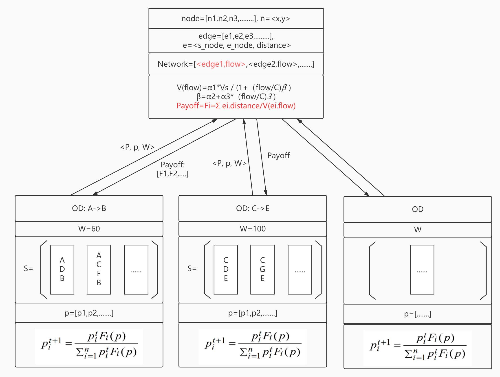

# 关于演化博弈

今年参加了国创，我们的课题是基于演化博弈的交通优化方案。

## 11/12

上周五我们去找老师讨论，提出了一个初步的模型，简要描述了路径的博弈方式和演化过程，大致如下：

老师听完之后，让我们开始做实验测试，并且讲了这个新模型和传统交通模型的对比，这段话让我印象很深刻：

**“ 其实演化博弈的结果是很难优于传统规划算法的，但演化博弈的好处是，他尊重个体的选择。这对实际城市规划是特别重要的，因为每个用户的目标是自己能够最快达到目的地，而不是路网效率最高，所以，系统中牺牲某些个体以达最优的策略会被这些用户拒绝。**

**政府对交通的调控，其实更多的是隐式地激励，而不能像计划经济一样安排每一个个体。所以，演化博弈模型可以用来测试激励方案，测试什么样的激励方案可以使演化博弈的结果更接近于传统规划的结果，越解决说明激励方案越好。 ”**

