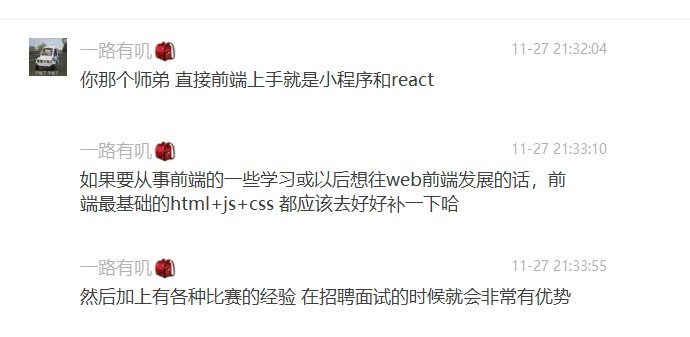

# 面试-腾讯互娱

---
description: 第一次投实习。
---

## 面试回顾
其实面试官问问题就是找一个切入点，如果你答的上就继续深入，如果答不上就换一个切入点。
以下是今天的几个问题

> react渲染列表的时候，为什么要绑定key？   
> js的变量提升？  
> inline和inline-block有什么区别？  
> 怎么做页面缓存？  
> 当渲染内容太多导致性能问题的时候，怎么处理？  
> JSONP和CORS解决跨域问题有什么区别，优缺点？  
> react中修改了state后，框架做了什么处理使得渲染层同步？  
> 生命周期函数有哪些，在什么时候调用？  
> 项目开发中有没有用过分包？  

今天是第一次面试，一问三不知，不过两天来刷面经倒是压中了不少知识点，但依然暴露了基础不扎实的问题。
当然，面试官肯定了我的项目经验，不过建议我不应该直接上手框架，而应该学好原生三件套。  
除了基础问题，其实还有很多是因为我**在学习过程中不求甚解**造成的，例如react运行时控制台已经明确地提醒我绑定key，但我没理会。
其实我也听说过分包的概念，但我并没有去了解他的作用。所以，**很多时候我只是以实现功能为目的，没有追求最优的性能，最便捷的方法**。

</img>

认识到缺点是好事，认识到了就去改正。

这次是育妍学姐帮我内推的，直接电话面试，可惜没准备好。打算在寒假前继续投一投，阿里、字节都试试，投普通招聘估计要过五关斩六将了。
我好希望寒假可以找份实习，如果等明年暑假真的太晚了，读研还是工作，我要给自己一个答案。当然，我也会和老师讨论一下科研的问题，如果老师给了我一个明确的方向，我用寒假时间专心做科研也是不错的。不过，和老师约时间可不容易，在自己还没确定之前，先继续复习前端面经吧，不一定要等到完全确定再开始复习，就是不实习，多学些知识也是好的。网上很多经验分享，他们可掌握的很透彻，甚至会去看react源码，看是怎么更新怎么渲染的，挺好。

把复习纳入日程，一周后或者两周后开始继续投。有点不确定企业会多久捞简历，不知道寒假前能不能面完。
字节跳动的几个岗感觉不错，还有一个是广州的。
阿里居然没有日常实习的通道。  

## 问题解析

#### react渲染列表的时候，为什么要绑定key？  

> 参考 https://cn.vuejs.org/v2/guide/list.html#%E7%BB%B4%E6%8A%A4%E7%8A%B6%E6%80%81：  
**"当 Vue 正在更新使用 v-for 渲染的元素列表时，它默认使用“就地更新”的策略。如果数据项的顺序被改变，Vue 将不会移动 DOM 元素来匹配数据项的顺序，而是就地更新每个元素，并且确保它们在每个索引位置正确渲染。"   
"这个默认的模式是高效的，但是只适用于不依赖子组件状态或临时 DOM 状态 (例如：表单输入值) 的列表渲染输出。"   
"为了给 Vue 一个提示，以便它能跟踪每个节点的身份，从而重用和重新排序现有元素，你需要为每项提供一个唯一 key attribute"    
"建议尽可能在使用 v-for 时提供 key attribute，除非遍历输出的 DOM 内容非常简单，或者是刻意依赖默认行为以获取性能上的提升。"**   
总结起来，就是，不绑定key可以就地更新，是高效的，但不能保证组件状态的正确。	绑定key，更新DOM时会对比key，不会复用，可以保证组件状态正确。  

#### react中修改了state后，框架做了什么处理使得渲染层同步？  

> 参考：https://zh-hans.reactjs.org/docs/faq-state.html#what-does-setstate-do  
在React的setState函数实现中，会根据一个变量isBatchingUpdates判断是直接更新this.state还是放到队列中回头再说，而isBatchingUpdates默认是false，也就表示setState会同步更新this.state，但是，有一个函数batchedUpdates，这个函数会把isBatchingUpdates修改为true，而当React在调用事件处理函数之前就会调用这个batchedUpdates，造成的后果，就是由React控制的事件处理过程setState不会同步更新this.state 。  
React文档：  
**目前，在事件处理函数内部的 setState 是异步的。例如，如果 Parent 和 Child 在同一个 click 事件中都调用了 setState ，这样就可以确保 Child 不会被重新渲染两次。取而代之的是，React 会将该 state “冲洗”，到浏览器事件结束的时候，再统一地进行更新。这种机制可以在大型应用中得到很好的性能提升。**  

#### js的变量提升？  

> 参考：https://juejin.cn/post/6844903895341219854  
所有的声明（function, var, let, const, class）都会被“提升”。  
function sayHi() {} 会提升function。 var helloWorld = function(){} 会提升var。  
只有使用var关键字声明的变量才会被初始化undefined值，而let和const声明的变量则不会被初始化值,class同理。**Temporal Dead Zone**

#### JSONP和CORS解决跨域问题有什么区别，优缺点？  

> JSONP:只能get请求，不能post。不能捕捉错误。  
CORS:支持各种请求以及错误处理。ie10以上支持。

