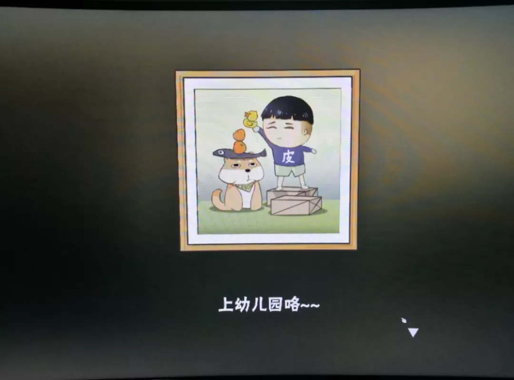

# 明天周一了

这两天情绪一直down down down  
原因大概是前天晚上做了个太美好的梦吧  
然后起床后心理落差太大，缓不过来

做梦其实挺有趣的一件事吧  
从小到大，每个晚上，梦境从来没有缺席过

有时候会觉得  
日有所思，夜有所梦  
有时候摇摇头说  
梦是反的

有时候会梦见未来的日子  
有时候会重演过去的回忆  
甚至偷偷修改剧本  
会梦见公布成绩的场景  
会梦见心上人在我身旁

会梦见小时候  
我两腿叉开坐在地板上玩玩具  
抬头看见爸妈从外边回来

也会梦见讨厌的人  
醒来后气还没消

最尴尬的一次，我梦见上课被英语老师提问  
我听到她喊我的名字  
但是我怎么也看不到黑板的问题  
她在讲台上喊说“你怎么还在睡觉？”  
我能听见，但是看不到  
就努力地睁大眼睛

然后我就真的睁开了眼睛  
没有黑板  
只有宿舍的天花板  
原来是一场梦

我也做白日梦  
这个说起来倒是羞愧  
高中时代的晚修有一半用来发呆了吧  
有时候分不清现实与幻想  
赶紧用冷水洗把脸  
人不应该闲下来就胡思乱想  
哈哈

今天早上看了奇葩说  
辩题是“爱先说出口就输了吗”  
作为一个本身思辨性就不强的人  
在这道题上更是两边倒  
其实也没怎么思考过辩题  
一直跟着辩手的思路走  
好像不是为了收获什么观点  
只是为了听听别人的故事  
发现其实他的故事也是和我很像  
不止我一个人这样子  
心理就会得到一些慰籍

从小到大爸妈好像就是这么安慰我的  
“这是很正常的”远远比“别担心别害怕”有用

大概这也是为什么那么多人  
热衷于在网易云音乐看评论吧  
和陌生人分享音乐，分享故事

的确很暖

我写的东西没什么逻辑，也懒得配图，见笑了

