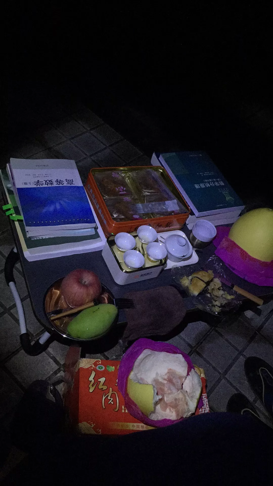

# 我想吃冰皮月饼

一步两步三步四步望着天手牵手~  
一颗两颗三颗四颗连成线看星星~  
今晚，是我少有的，特别认真地听家庭群的每一条语言

是中秋夜啊  
我吃了两碗米饭，茄子，金针菇还有不知道怎么叫的青菜  
胃口丝毫不受节日的影响，真香  
突然还在思考高三什么时候要返校

舍友们在讨论潮汕地区的节日习俗  
因为我，往桌子上摆了月饼柚子  
旁边摞了一叠课本，线性代数、数学分析、c++  
拜月娘，也是潮汕人了吧  
广州其实没有很思乡的，走在大学城路上听见的潮汕话不比白话少

或者坦白讲，结合高中的经验，想家多半是因为生病或者遇上不开心的事  
然后就常常一言不合打电话说要回家  
所以被同学吐槽说  
“周末留宿，工作日请假，我以后当老板肯定不会雇你”  
来了广州二十天了  
发现自己早已摆脱高中生的身份，却迟迟没有进入大学生的角色  
因为脑子不定期短路

> 会忘记去上课
>
> 会忘记带钥匙
>
> 手机忘记充电
>
> 衣服放洗衣机忘记晾
>
> 忘记自己在读大学

