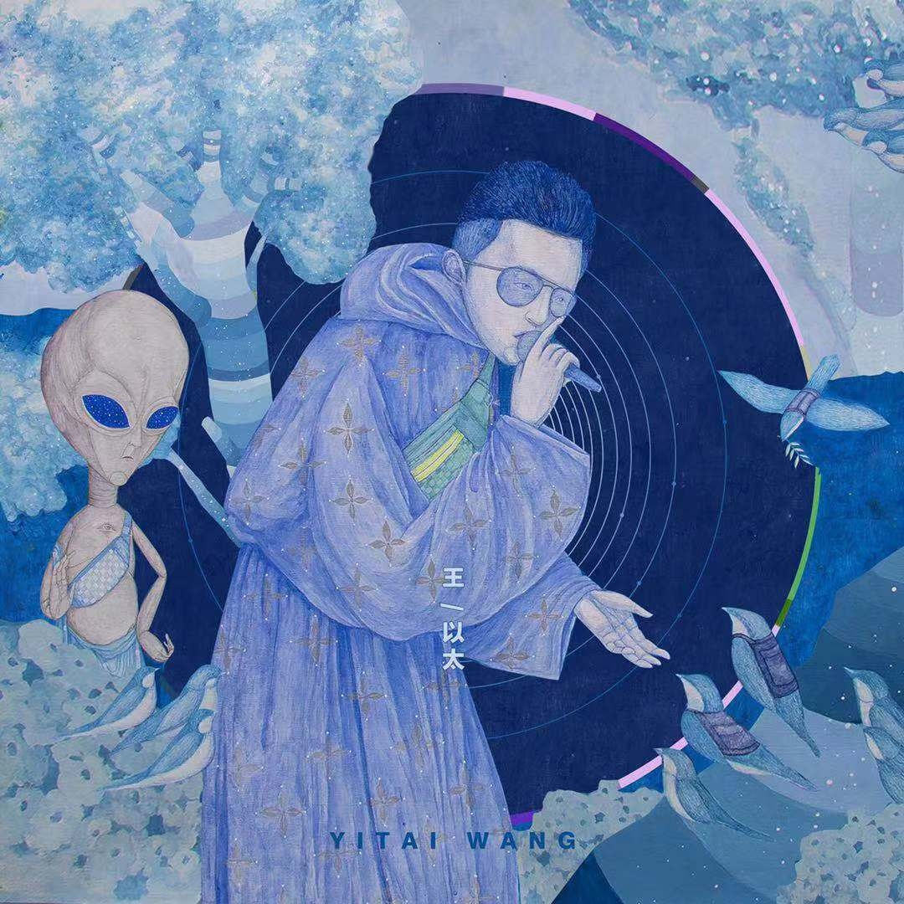
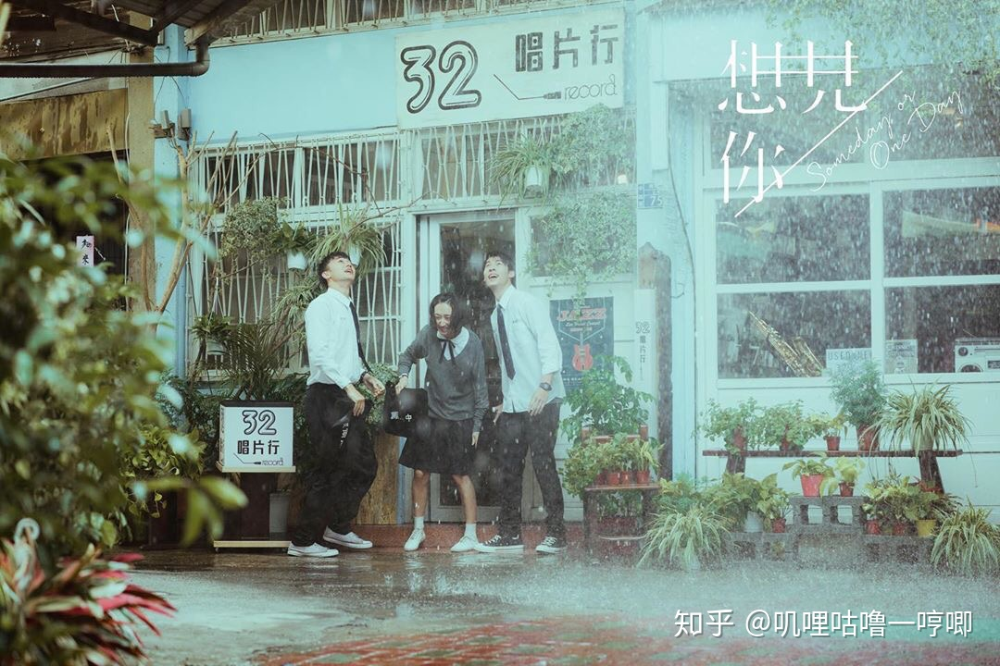

<h1>阿泰随想录</h1>

####11/13
感觉最近生活中触动到我，使我难过的东西，都是同一个主题，变老。这事分两方面，一方面，对家人，另一方面，对自己。就像派总歌里讲的，“尽管害怕可我知道一定会有那一天，一通电话就能让我崩溃的那一天”，在这个事情上我几乎无法开导自己，好像我只能一边珍惜，一边担心。我自己也害怕变老，上次看《美丽心灵》看的很揪心，我害怕变老，更害怕老了之后没有什么值得自己骄傲的事情，或者没有可以依靠的人。支撑我一路求学的很大一部分动力是，我想找到自我认同感，我想自己未来的生活是充实而富有创造力的，我想成为自己心目中相对完美的成熟男人。

####11/17
555人太瘦了穿衣服都不好看，尤其是短袖。
> 做到你嘴里的不可能，成为男人中的男人。 -- 《CEO》 pact

####11/19
明天有机会找老师讨论，开始我现在乱糟糟的，整理不好思路，不知道咋办。
今天互联网加颁奖礼，我混进内场近距离看了全程，场面挺大的，节目也就凑合，参加颁奖礼真是一个感受peer pressure的绝佳机会。
明早要不要去找老师呢55555

####11/20
**愿中国青年都摆脱冷气，只是向上走，不必听自暴自弃者流的话。
能做事的做事，能发声的发声。
有一份热，发一份光，
就令萤火一般，也可以在黑暗里发一点光，
不必等待炬火。
（鲁迅 《热风·随感录四十一》）**

	
####11/24
不开心，明明我有很多时间，却不知道做什么。
第一件事，被SRP实验整自闭了，可能还是得去找老师，自己看不出什么。
第二，数据库大作业进度太慢了，我试着在群里问用不用给他们讲一下react，但是没人说话。
挺膈应人的。但想了想还是不置气了，说不定他们最近忙别的，打算做完才在群里分享。我觉得比较好的合作方式应该是
细化自己的工作，高频率地汇报，GitHub项目都建好了，他们就是不用，现在又冷暴力，我都懒得和他们说道了。
第三，简历不太会写，项目经历总结的不太满意。

倒也不是啥事没有，只是现在各种事情都让我提不起兴趣

> 高性能实验\*4  
> 软工实验  
> 马原论文

####11/25
我不需要劳逸结合，我不需要娱乐，我只想出人头地。😡😡😡

####11/27
今天和原哥聊了一会儿，意识到了自己身上的一些问题。  

到了大三仍然**目标不明确**，到底是想做科研、还是想做应用、还是想找工作。
其实已经不早了，应该选一个路并以此为方向走下去了。

另一个问题，**和老师沟通**不够，因为每个老师的博士名额是屈指可数的，所以得提前和老师沟通这个问题，
如果我想跟你，名额能不能给我？如果我跟你读博，你对我的规划是什么？

没有形成自己清晰完整的**世界观**，所以不自信，不知道做什么。

寒假前找几位老师聊聊这个问题吧，目前想找王昊翔老师和陈伟能老师。

####12/2(凌晨)
今天在宣讲会遇到了建业学长，聊了会就业问题，有所启发。  
后端也是可以选的，无论前端后端，选择确定后要准备花几个月集中精力复习，才有可能上岸  
不过我还不确定，如果实验室有工作可以做，那这几个月花在实验室可能对研究生发展更好。  

	
####11/29
今天干了一件蠢事，让佳俊帮我测引体向上，结果被发现了，我们两个的校卡都被拍了，不知道会不会有处分。好难受，不该耍小聪明，还拖累了朋友，我真是又蠢又坏，请求别人帮忙时，这个请求的风险是要自己判断的，因为别人一般不会拒绝的，所以，对方被拖累我负全责，因为我没有考虑到这个风险性。哎，哎，持续关注教务处公示吧，但要是真的被公示了我能做什么呢？一切变数都掌握在老师手上。

> 收起你的小聪明。

有一个疑问，为什么我的一千米退步了一分钟。。。我的体型好像也没有变化太多呀。疑惑。

####12/2(凌晨)
明天起床后：下载实验数据，处理；写快排mpi  
mpi真好用，我要把DCCA改成mpi，当作第四次实验  
今天在宣讲会遇到了建业学长，聊了会就业问题，有所启发。  
后端也是可以选的，无论前端后端，选择确定后要准备花几个月集中精力复习，才有可能上岸  
不过我还不确定，如果实验室有工作可以做，那这几个月花在实验室可能对研究生发展更好。  
（隐隐约约又开始担心前几天体测被抓的事情....别搞我呀，我错了，真错了。

####12/3
我佛了，好不容易去找老师一趟，忘记问读研的事情了。啊啊啊。难受死我了。
老师实在是太难约了。  
需要再改实验：同步间隔与分配间隔相同，α有必要讨论吗？其实要讨论同步间隔也可以不做资源分配吧？两种都试试看
可以改成mpi了，hadoop没有多节点集群真是大材小用。  链式不可分中间要切开吗
后半星期，要做的事情还挺多的，图形学作业、图形学实验、软工实验二、马克思论文	

####12/4
如果读研了，想买台电子琴。虽然读研的概率是有的，但我还是不太自信，所以等推免后再买吧。西方音乐史里面有好多歌都很好听。  
想回家！  

####12/5
这个页面逐渐沦为日记了，感觉不太好，尽量只写一些完整有益的生活思考吧。

####12/6
看摊老师的直播，不禁回忆起中学时代，那种学习的感觉。而上了大学，一切都是自由的，一切都是你自己的选择。我在说什么呢。。。

我每天真的会花很多时间在娱乐上，用来抵消焦虑。
如果全心全意在学习上，大概能学很多吧，不过就是犹豫吧，准备面试还是做实验，犹豫了，做不出选择，得不到答案。
现在看到陈老师那么忙，不禁后悔当初他花半小时给我介绍实验室的时候我没有好好珍惜，真蠢。现在的我，老师真的会收我读研吗。
我不知道。感觉概率低。陈老师是很用心的，是一个好老师。期末前应该可以做完这个调研吧，反正没啥动力复习。呜呜呜。
过几天找洋哥聊聊。
学长说期末考后，我这段时间适当准备一下问题吧

####12/9
今天翻康哟喂的微博，发现康哟喂是差评工作室的，接着又关注了差评工作室的其他两个up，看了好多视频和日常，气氛很好的一个公
这个时间适合写马原论文，不过不知道如何动笔，我打算五点去吃饭，吃完饭练琴，今晚早考早解放。
话说，我又没有看前端面经了，，，因为越来越觉得自己应该在这一年找到一个合适的老师，为研究生做准备。
像原哥说的，四处尝试不一定是好的，有时候需要找准方向努力钻研。太想和陈老师聊聊了，只不过不知道怎么约。
我想问他我寒假可以做什么，下学期可以做什么。

一周后就要考软工了！！！我还没开始复习！！！今天看看能不能打个复习计划。

1. 复习计划
2. 六级做题
3. 写dcca mpi

不是出于热爱，但是忠于选择

####12/14
刚刚和爸妈通了电话，期间不小心说了一句感觉对于明年直博的事情压力很大，一秒后就后悔了，感觉不太应该和他们表达负面情绪，我妈最擅长的就是担心了。不过今晚还好，他们讨论了一番后给了我几个建议，然后就结束了话题，应该不会想多。哈哈。我也别太理所应当了，好好准备这个月的考试吧，要是挂了科我就一无所有了。学！

####12/15
看到一个网友讲自己读研：“不是出于热爱，但是忠于选择”，这句挺好，坚持一件事情不一定是热爱和享受，也可以是其他原因。这让我联想到另一篇讨论“坚持”的帖子，讲道：“太注重自己的感受就容易放弃，锻炼的时候一直感受，我好累，就不想做了”，“那些很坚持下来的人，其实没那么多感受”。这是关于自我驱动的一个新的思考方向。

去年和一个高中同学起了一次冲突，这件事告诉我一个深刻的道理，永远要站在自己的角度思考问题，不要让他人左右你的立场。说来愧疚，说来话长，下次再说。

今天计网实验自己做了一遍，好像有点理解路由器了。上节课抱大腿，自己下意识觉得这东西很麻烦，想着这节课也继续抱大腿，不过这节课没得抱，只得自己照着教程做，到五点多终于做好了。实验四是FTP文件传输，看起来很高大上，很感兴趣。

今晚写计网实验报告发现截图不够，下次再截几张吧，争取下次上课前做完实验四，然后课上把三个实验报告一起写完。

今天计网实验自己做了一遍，好像有点理解路由器了。上节课抱大腿，自己下意识觉得这东西很麻烦，想着这节课也继续抱大腿，不过这节课没得抱，只得自己照着教程做，到五点多终于做好了。实验四是FTP文件传输，看起来很高大上，很感兴趣。

同源是怎么做的？

####12/16
有时候看到别人的旅游vlog确实挺羡慕的，但自己好像又确实不擅长旅行，也没有记录影像的耐心（？
看深蓝儿童，看差评工作室，有工作，有娱乐，这样的生活真好
emmmm寒假其实不太想实习了，一是面试很怂，二是想在家躺着。额。
好好复习吧，期末不要挂科。
总感觉数字图像大作业和图形学作业是个隐患，下周很有可能花费过多时间在这上面，咋办嘞。
软工不管ruby还好，应该复习的完。额。
出，居然没有带笔记本。
舍友也太飘了，不复习软工，搞得我开始自我怀疑

####12/19
在自习室，椅子嘎吱嘎吱地响，害怕打扰到其他同学，所以只能保持一个姿势不动，有点不舒适。
今晚学了一些图形学，静下心还是学的进的，这次作业覆盖的范围很广，我得再看看光线追踪（即全局光照模型）和明暗处理，纹理映射。纹理映射和光线追踪我记得老师是有讲的，可是不知道为什么在课件没见到。
突然不乐意学了，才九点半，今晚早点睡吧，把生物钟改回来，今天早上睡到十一点，，，不好不好。
数据库大作业和我预想的一样，因为拖延，割舍了很多功能，现在只能祈祷项目正常完成收尾了。
要是这两天能够一鼓作气把图形学做完，负担会小一点。其实还是有希望的，就是一点一点克服困难罢了。然后emmmm写写数据库报告。迎接下一周的实验和复习，这么一想还不错。

####12/19  
**2020最受阿泰喜爱的专辑：《三只头的狗》和《演说家》**  

**2020最受阿泰喜爱的电视剧：《想见你》**  

  
**2020阿泰没有记住哪一部电影**

**2020阿泰没有读过印象深刻的书**