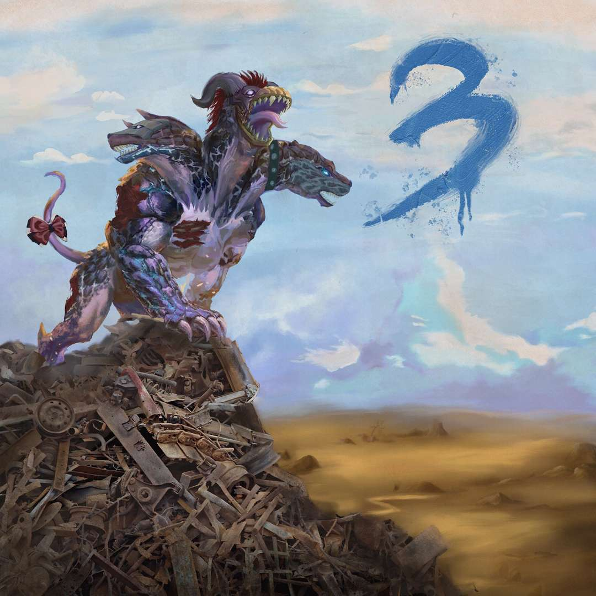
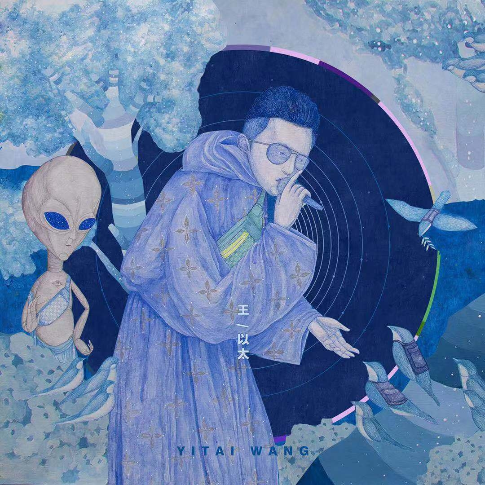
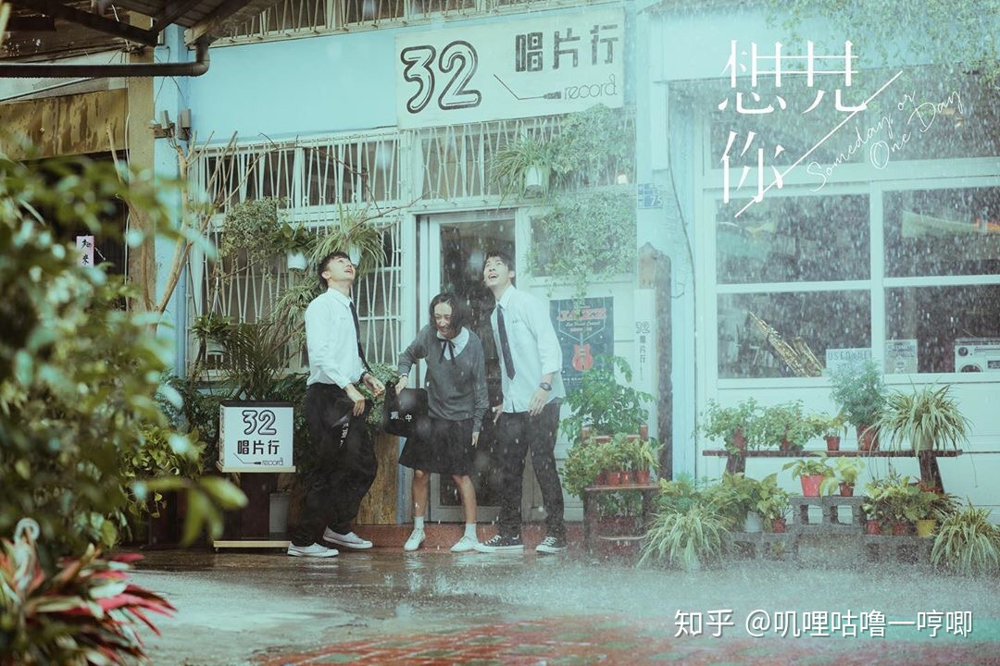
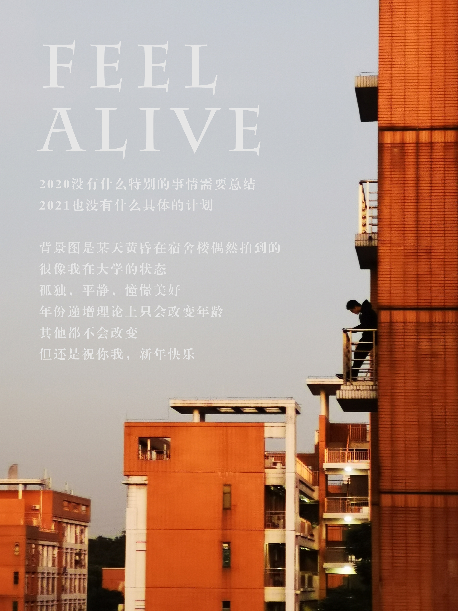

# 阿泰随想录

## 2020年

### 11月

#### 11/13
感觉最近生活中触动到我，使我难过的东西，都是同一个主题，变老。这事分两方面，一方面，对家人，另一方面，对自己。就像派总歌里讲的，“尽管害怕可我知道一定会有那一天，一通电话就能让我崩溃的那一天”，在这个事情上我几乎无法开导自己，好像我只能一边珍惜，一边担心。我自己也害怕变老，上次看《美丽心灵》看的很揪心，我害怕变老，更害怕老了之后没有什么值得自己骄傲的事情，或者没有可以依靠的人。支撑我一路求学的很大一部分动力是，我想找到自我认同感，我想自己未来的生活是充实而富有创造力的，我想成为自己心目中相对完美的成熟男人。

#### 11/20
**愿中国青年都摆脱冷气，只是向上走，不必听自暴自弃者流的话。
能做事的做事，能发声的发声。
有一份热，发一份光，
就令萤火一般，也可以在黑暗里发一点光，
不必等待炬火。
（鲁迅 《热风·随感录四十一》）**

#### 11/25
我不需要劳逸结合，我不需要娱乐，我只想出人头地。😡😡😡

#### 11/27
今天和原哥聊了一会儿，意识到了自己身上的一些问题。  

到了大三仍然**目标不明确**，到底是想做科研、还是想做应用、还是想找工作。
其实已经不早了，应该选一个路并以此为方向走下去了。

另一个问题，**和老师沟通**不够，因为每个老师的博士名额是屈指可数的，所以得提前和老师沟通这个问题，
如果我想跟你，名额能不能给我？如果我跟你读博，你对我的规划是什么？

没有形成自己清晰完整的**世界观**，所以不自信，不知道做什么。

寒假前找几位老师聊聊这个问题吧，目前想找王昊翔老师和陈伟能老师。

### 12月

#### 12/2(凌晨)
今天在宣讲会遇到了建业学长，聊了会就业问题，有所启发。  
后端也是可以选的，无论前端后端，选择确定后要准备花几个月集中精力复习，才有可能上岸  
不过我还不确定，如果实验室有工作可以做，那这几个月花在实验室可能对研究生发展更好。  

#### 12/14
刚刚和爸妈通了电话，期间不小心说了一句感觉对于明年直博的事情压力很大，一秒后就后悔了，感觉不太应该和他们表达负面情绪，我妈最擅长的就是担心了。不过今晚还好，他们讨论了一番后给了我几个建议，然后就结束了话题，应该不会想多。哈哈。我也别太理所应当了，好好准备这个月的考试吧，要是挂了科我就一无所有了。学！

#### 12/15
看到一个网友讲自己读研：“不是出于热爱，但是忠于选择”，这句挺好，坚持一件事情不一定是热爱和享受，也可以是其他原因。这让我联想到另一篇讨论“坚持”的帖子，讲道：“太注重自己的感受就容易放弃，锻炼的时候一直感受，我好累，就不想做了”，“那些很坚持下来的人，其实没那么多感受”。这是关于自我驱动的一个新的思考方向。

去年和一个高中同学起了一次冲突，这件事告诉我一个深刻的道理，永远要站在自己的角度思考问题，不要让他人左右你的立场。说来愧疚，说来话长，下次再说。

#### 12/19  
**2020最受阿泰喜爱的专辑：《三只头的狗》和《演说家》**  
</img>

**2020最受阿泰喜爱的电视剧：《想见你》**  
</img>

## 2021年

### 1月

#### 1.2
这图拍的真好啊，文字编辑了好久，但左思右想，还是不敢发朋友圈。我特别想做一个视频，总结自己，或是介绍自己，甚至是介绍我的家人。寒假有时间，写文稿，想镜头，找参考样例，拍视频，录音，找配乐，剪辑。have a try！

#### 1.10
回家了。前天找周洋学长聊了一会，对保研流程更清楚了一些，5月要向导师投递申请然后面试，9月和导师填双向确认。突然不想找实习了，首先是因为现在找实习只能找前端（当然，还得做充足的复习），与读研相关性不大，然后下学期暑假的安排又得看老师，时间不多。所以我想尽量在实验室多做点东西吧~如果老师乐意给我反馈的话~这是最理想的。

#### 1.27
我已经见过太多未经实锤的网暴了，当事人受到的伤害是键盘侠们无法想象的，去年十月，华工教授王雨磊，今年年初，高天佐，等等。
造谣一张嘴，辟谣跑断腿，现代信息传播之快，可以在短时间内对你狂轰滥炸，瞬间社会性死亡。等你反应过来整理材料自证清白时，已经没人关注你的事情了，你剩余的发声空间有多大呢?只剩你的朋友圈罢了。
正如王雨磊教授所说，天下最难受之事，就是忍受善良之人的怒骂。虽是善良人，但却被舆论错误引导，当代舆论环境该如何破局呢!
我气愤，我决定从今日起一段时间，不再登录知乎、微博、豆瓣。

### 2月

#### 2.9
我是一个很期待被关注的人，所以很羡慕那些公众号作者和B站视频UP主，但是以我现阶段的技能，确实想不到有什么特长可以让我获得粉丝。或许是制作小游戏？确实，我挺羡慕自由创作者身份的，无论是媒体类还是科技类。

#### 2.23
你好，李焕英。
一部催人泪下的电影。
“打我有记忆起，妈妈就是中年妇女的样子，我似乎忘了，她曾经也是一个花季少女。