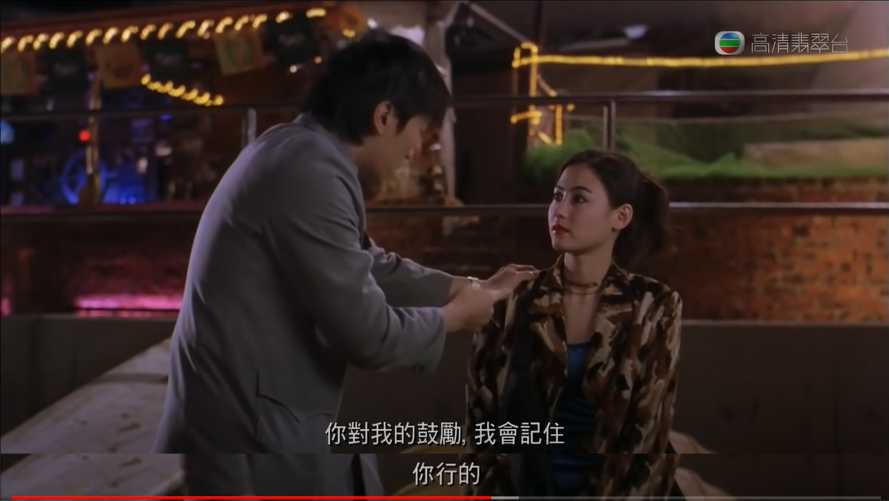
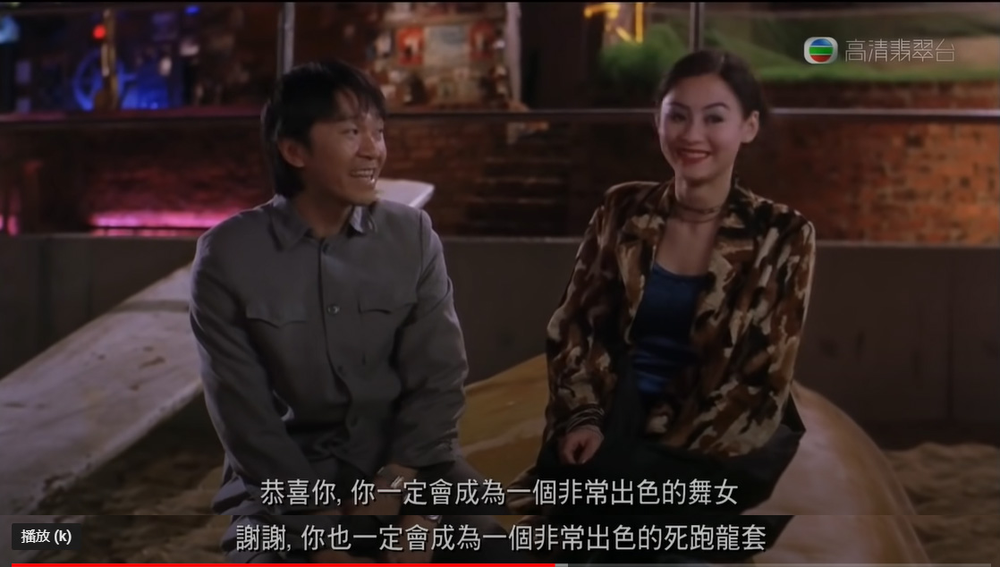
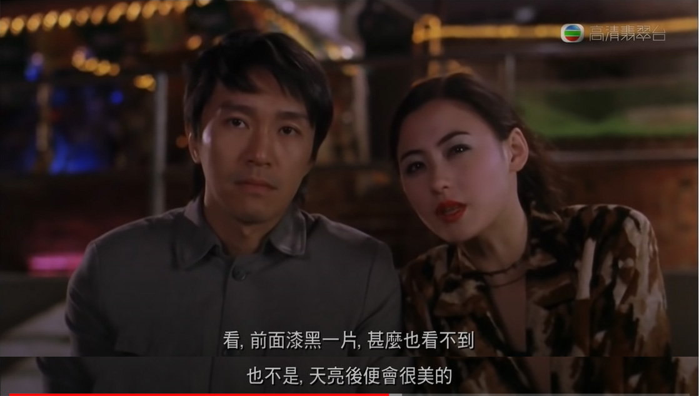

# 阿泰随想录

## 2020年

### 11月

#### 11/13

感觉最近生活中触动到我，使我难过的东西，都是同一个主题，变老。这事分两方面，一方面，对家人，另一方面，对自己。就像派总歌里讲的，“尽管害怕可我知道一定会有那一天，一通电话就能让我崩溃的那一天”，在这个事情上我几乎无法开导自己，好像我只能一边珍惜，一边担心。我自己也害怕变老，上次看《美丽心灵》看的很揪心，我害怕变老，更害怕老了之后没有什么值得自己骄傲的事情，或者没有可以依靠的人。支撑我一路求学的很大一部分动力是，我想找到自我认同感，我想自己未来的生活是充实而富有创造力的，我想成为自己心目中相对完美的成熟男人。

#### 11/20

**愿中国青年都摆脱冷气，只是向上走，不必听自暴自弃者流的话。 能做事的做事，能发声的发声。 有一份热，发一份光， 就令萤火一般，也可以在黑暗里发一点光， 不必等待炬火。 （鲁迅 《热风·随感录四十一》）**

#### 11/25

我不需要劳逸结合，我不需要娱乐，我只想出人头地。😡😡😡

#### 11/27

今天和原哥聊了一会儿，意识到了自己身上的一些问题。

到了大三仍然**目标不明确**，到底是想做科研、还是想做应用、还是想找工作。 其实已经不早了，应该选一个路并以此为方向走下去了。

另一个问题，**和老师沟通**不够，因为每个老师的博士名额是屈指可数的，所以得提前和老师沟通这个问题， 如果我想跟你，名额能不能给我？如果我跟你读博，你对我的规划是什么？

没有形成自己清晰完整的**世界观**，所以不自信，不知道做什么。

寒假前找几位老师聊聊这个问题吧，目前想找王昊翔老师和陈伟能老师。

### 12月

#### 12/2\(凌晨\)

今天在宣讲会遇到了建业学长，聊了会就业问题，有所启发。  
后端也是可以选的，无论前端后端，选择确定后要准备花几个月集中精力复习，才有可能上岸  
不过我还不确定，如果实验室有工作可以做，那这几个月花在实验室可能对研究生发展更好。

#### 12/14

刚刚和爸妈通了电话，期间不小心说了一句感觉对于明年直博的事情压力很大，一秒后就后悔了，感觉不太应该和他们表达负面情绪，我妈最擅长的就是担心了。不过今晚还好，他们讨论了一番后给了我几个建议，然后就结束了话题，应该不会想多。哈哈。我也别太理所应当了，好好准备这个月的考试吧，要是挂了科我就一无所有了。学！

#### 12/15

看到一个网友讲自己读研：“不是出于热爱，但是忠于选择”，这句挺好，坚持一件事情不一定是热爱和享受，也可以是其他原因。这让我联想到另一篇讨论“坚持”的帖子，讲道：“太注重自己的感受就容易放弃，锻炼的时候一直感受，我好累，就不想做了”，“那些很坚持下来的人，其实没那么多感受”。这是关于自我驱动的一个新的思考方向。

去年和一个高中同学起了一次冲突，这件事告诉我一个深刻的道理，永远要站在自己的角度思考问题，不要让他人左右你的立场。说来愧疚，说来话长，下次再说。

#### 12/19

**2020最受阿泰喜爱的专辑：《三只头的狗》和《演说家》**  
 

**2020最受阿泰喜爱的电视剧：《想见你》**  

## 2021年

### 1月

#### 1.2

这图拍的真好啊，文字编辑了好久，但左思右想，还是不敢发朋友圈。我特别想做一个视频，总结自己，或是介绍自己，甚至是介绍我的家人。寒假有时间，写文稿，想镜头，找参考样例，拍视频，录音，找配乐，剪辑。have a try！

#### 1.10

    回家了。前天找周洋学长聊了一会，对保研流程更清楚了一些，5月要向导师投递申请然后面试，9月和导师填双向确认。突然不想找实习了，首先是因为现在找实习只能找前端（当然，还得做充足的复习），与读研相关性不大，然后下学期暑假的安排又得看老师，时间不多。所以我想尽量在实验室多做点东西吧~如果老师乐意给我反馈的话~这是最理想的。

#### 1.27

    我已经见过太多未经实锤的网暴了，当事人受到的伤害是键盘侠们无法想象的，去年十月，华工教授王雨磊，今年年初，高天佐，等等。 造谣一张嘴，辟谣跑断腿，现代信息传播之快，可以在短时间内对你狂轰滥炸，瞬间社会性死亡。等你反应过来整理材料自证清白时，已经没人关注你的事情了，你剩余的发声空间有多大呢?只剩你的朋友圈罢了。 正如王雨磊教授所说，天下最难受之事，就是忍受善良之人的怒骂。虽是善良人，但却被舆论错误引导，当代舆论环境该如何破局呢! 我气愤，我决定从今日起一段时间，不再登录知乎、微博、豆瓣。

### 2月

#### 2.9

    我是一个很期待被关注的人，所以很羡慕那些公众号作者和B站视频UP主，但是以我现阶段的技能，确实想不到有什么特长可以让我获得粉丝。或许是制作小游戏？确实，我挺羡慕自由创作者身份的，无论是媒体类还是科技类。

#### 2.23

你好，李焕英。

 一部催人泪下的电影。

 “打我有记忆起，妈妈就是中年妇女的样子，我似乎忘了，她曾经也是一个花季少女。

### 3月

**3.15**

    自从11号面试完之后，我一直在焦急地等待邮件通知。我承认这次面试我表现的不太好，因为我只复习了前端的知识点，但面试时好几个问题都是后台开发的。我觉得这次也不能完全怪自己，是项目组没有通知清楚呀，你们应该通知我们说这场面试是综合能力面试，而不是让我们”按团队分工的岗位投递简历“。事已至此，我还抱有一丝期待，如果项目组遵循”每个团队入选不少于两人“，那我还有一点希望入选。焦虑不能解决问题，我要像之前说的那样，珍惜自己手头有的项目，把他们做好，这样才有可能变得优秀，而不是揽一大堆项目却没有输出。

​     最近对自己的外貌有些在意，尤其是面部五官皮肤，看到皮肤白皙的男生很是羡慕。五官这个没办法，眼睛又不可能变大，视力也不可能恢复，只能幻想着在皮肤和身材上有所改变。

    昨晚竟梦见陈老师了，难道我的内心对他的亲近度增加了？真是奇怪，明明上周三刚刚见过，但记不起他的声音和表情了。

#### 3.21

    我不得不承认，我对某个同学的关注度逐渐增高了。

#### 3.24

    觉得走在路上没事做浪费时间是因为在书桌前没有利用好时间，导致内心有亏欠，想要补偿。

#### 3.26

#### 3.27

    近日时常纠结研究生的方向选择，在网上浏览了相关讨论，收集到以下几个合理的观点：1. 就算岗位与你的专业不对口，你在研究生期间积累的研究经验也能帮助你获得好的岗位。2. 就是岗位与你的专业对口，但是你在面试时没有表现出优秀的专业素养，扎实的基础知识，在研究生期间研究成果不突出，比赛经历不突出，那么你也很难获得对口的岗位。 3. 研究生不突出就去只能做开发。4. 计算智能方向毕业后去高校的比例较高。 5. 就算是热门如机器学习岗，面试时问的问题百分之六七十还是基础算法知识，剩下的才是机器学习的知识或者是研究生研究内容。

    经过两次腾讯的面试，以及与舍友面试的对比，我其实有点意识到自己的缺点所在，我的表达能力和思维能力比较差。其实我该认清自己几斤几两的，不能因为有个保研的机会就觉得自己可以走上人生巅峰，如果我保持目前的思想和水平，研究生毕业估计也只能找到开发岗的工作。据我对舍友面试的观察，他是一个很能清晰地表达观点的人，就算遇到不清楚的问题也能够自信的稍加解释，他是一个很成熟的人，在面试中，无论是回答问题，还是反问问题，都体现出他是一个很成熟，有做好进入职场准备的人。反观我自己的面试，我十分被动，只能回答自己了解的少数问题，并且十分吝啬于表达，没有把自己的所有知道的都整合起来，只期望着面试官对我的问题全是我擅长的，从没有主动地引导面试官，也没有在面试过程中思考。

例如上次面试官问我对高性能这方面有没有了解，我的回答是，”**我用过hadoop、mpi，这是我对高性能的了解**“，但事后想想，我明明是学过高性能计算的呀，我为什么不能针对这个问题客观地回答呢，例如：”**我认为高性能计算是一个非常重要的领域，充分地利用计算资源可以提高计算效率，高性能中关键的点在于并行计算，对于复杂的计算问题，将算法并行化是一个有挑战的课题，例如，我今年在导师的实验室中，就在研究分布式的大规模优化算法，使用的是mpi。对于大量的计算请求的话，挑战点则在于合理地分配计算资源，使得计算集群的整体利用率尽可能的高。以上是我对高性能的理解。**“

我觉得主要问题在于，我总是在面试时企图将面试官的问题与我自己的项目经历去匹配，总是渴望用自己做过的项目去回答面试官，却忽略了自己的知识的价值。知识、项目，我似乎在本科期间很重视后者，觉得后者能够带给我满足感充实感，但是在最近求职面试时才发现，我做了那么多重复的找不出亮点的项目，其实对于面试的加分不大。就像去年腾讯互娱面试官的评价，如果直接上手框架却不夯实基础知识，那么和非科班的人有什么区别？

这个问题挺真实的，虽然我一直不愿面对，但我逃避不了的，如果我不改变的话，硕士毕业或者博士毕业之后求职面临的处境也是一样的。到时候我连天天打游戏的舍友还难找工作，真的。

除了这个表达问题，基础算法也很重要。上次面试官给的三个c++基础题我都没有做出来，说明我的基础是不扎实的。所以，如果想要在大厂找到好工作，也不能单单沉浸于自己的研究领域，应当夯实基础。好的基础知识，成熟的表达能力，研究经验，是可以帮助一个人找到心仪的岗位的。

以上，是我在出去玩了半天后突如其来的自我反思，我认为还蛮对点的。

### 4月

#### 4.4

   **** 清明节，没有回家，也没有出去玩。之前感觉好忙好忙，连微信面试都推掉了，现在写完算法阐述又突然好像没事可做了。四月了，可能大多数公司的坑位都快填满了吧，现在再投还有希望吗？

#### 4.14

    突然意识到，自己的项目有点水，没什么亮点，有点经不起追问。只有编译系统大赛相对来说好看一点，可是这不是前端项目，感觉面试官提问的概率不高，所以我也不知道要不要去复习，上次被问到确实有点一问三不知，然后口述算法也说不清楚，口述算法可太难了，当时尴尬的不行。前端项目有没有什么可以优化的点呢？只有四天时间了，我突然不知道要不要去联系蔡老师，好像一般提前联系都是希望提前进入实验室学习，可我又想实习，突然不知道该咋办。昨天约面试的时候感觉等到下周一要等好久，今天突然觉得自己复习不完啊，而且好多硬伤。我大概率不行的，我依稀记得pp在三面聊论文聊了半个多小时，我没有这种项目可以聊呀。靠，这也太难了，找个实习真不容易。  
    有时候觉得人生的很多选择确实挺难的，家人们虽然很关切，但他们毕竟不能感同身受，只能依照他们的经历来给我提建议，有时候是有点强烈粗鲁的建议，我尽量保持谨慎，自己要权衡好利弊。

     突然意识到一个问题，我好像临场思考能力太差了，比如，本来去找老师是去讨论问题的，但老师抛出一个想法之后，我就想着，好吧按着这个做，不再发言，这个过程好像失去了沟通的意义，想法得不到及时交流，进度自然就慢了。我靠，我上次明明对于曲线的趋势是有疑问的，但是我想的都是，回去之后再做，再思考。 我靠。

**4. 15**

  ****  解决问题时总是不可避免地绕一些弯路，归根结底是因为没有认清问题的本质。最近使用蒸蛋器时，发现蒸汽口里电脑太近了，希望换个方向，于是我将整个蒸蛋器转了半圈，但是由于电线的牵制，蒸蛋器整体离电脑更近了。而今天，我突然意识到，我根本没必要转动蒸蛋器，因为笼盖和底部是分开的，只要把笼盖转到另一边就好了。

