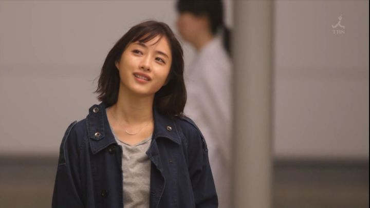
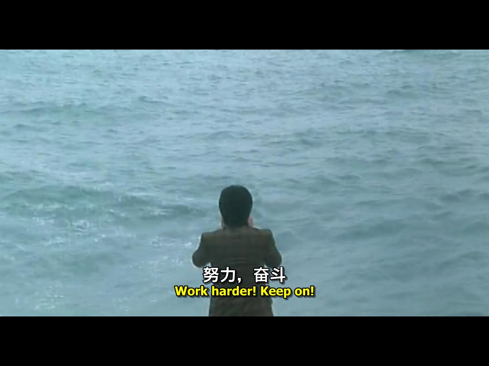

# 我喜欢的影视作品

### 进击的巨人

    这周刚刚看完第四季最新一集，这四季带给我的观剧体验，震撼到难以言说。

1. 主题曲：啦啦啦啦啦滴答啦呖呖呖呖啦
2. 热血中二：我tm直接献出心脏
3. 座右铭：我是自由的，从出生的那一刻开始
4. 情感：呜呜艾伦
5. 世界设定：不战之誓

### 想见你

    我发现，我与一部剧的缘分往往都是从某个失眠的深夜开始的。这是去年四月份看的，挂着网课，三天就刷完了，实在是一部优秀的作品。打算有空二刷。”所以暂时将你眼睛闭了起来，可以慢慢走进我的心怀~“

### 非自然死亡

### 飞驰人生

### 西虹市首富

### 夏洛特烦恼

### 少年的你

### 喜剧之王

### 功夫

### 少林足球

很多名场面，很多致敬，特效做的不错，演员的功夫也挺不错。

